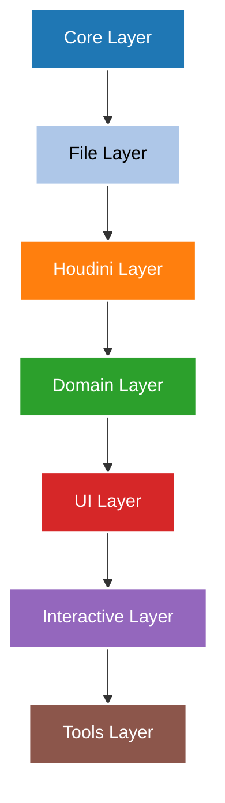

# LH Houdini Pipeline

[](https://www.python.org/)
[](https://www.sidefx.com/)
[](LICENSE)

A component-based Houdini pipeline framework. Designed with a modular, Lego-brick philosophy where reusable components are built first and then composed into high-level tools.

---

## 🏗️ Architecture

The pipeline follows a strict, unidirectional layered dependency order. A lower layer must never import from a higher layer:



### Layer Breakdown

| Layer | Package | Constraints & Description |
| :--- | :--- | :--- |
| **Core** | `core/` | Pure Python utility functions. Zero `hou` imports. |
| **File** | `file/` | Filesystem operations, texture parsing, and asset scanning. No `hou` imports. |
| **Houdini** | `houdini/` | Houdini Object Model (HOM) wrappers. All `hou` usage lives here. |
| **Domain** | `materialx/`, `lookdev/` | Domain-specific logic (e.g. MaterialX shader building). May import `houdini/`. |
| **UI** | `ui/` | GUI components (PySide2/PySide6 only). |
| **Interactive** | `interactive/` | Viewport states, custom drawables, and interactive HUD guides. |
| **Tools** | `tools/` | High-level compositions and tool entry-points. |

---

## 📦 Package Layout

```text
lh_houdini_pipeline/
├── core/
│   ├── path.py           - Path template rendering and normalization
│   ├── config.py         - Immutable configuration system with deep merging
│   ├── logger.py         - Thread-safe contextual logging
│   ├── executor.py       - Subprocess execution wrapper with retry policies
│   ├── validators.py     - File validation helper stubs
│   └── reload.py         - In-Houdini package hot-reloading
├── file/
│   ├── texture_parser.py - Texture info parser supporting UDIM and colorspaces
│   ├── versioning.py     - Semantic version resolver for asset paths
│   ├── scanner.py        - File discovery stubs
│   └── cache_utils.py    - Frame-range and cache gap detectors
├── houdini/              - HDA, parameter, USD/LOP, and animation helpers
├── materialx/
│   └── rules.py          - StandardSurface channel mappings and shader builders
├── lookdev/              - Turntables, light rigs, and color calibration
├── ui/                   - Custom PySide widgets and dialog layouts
├── interactive/          - Custom viewer states and viewport handle setups
└── tools/                - Modular tools: project manager, cam manager, asset builders
```

---

## 🚀 Getting Started

### Prerequisites

* Python 3.7+
* Houdini 19.5+ (for layers starting from the `houdini` layer onwards)

### Installation

Clone the repository and add it to your python path or Houdini environment:

```bash
git clone https://github.com/Omario92/LH-Houdini-Pipeline.git
```

Set the python path:

```bash
# Windows
set PYTHONPATH=%PYTHONPATH%;C:\path\to\LH-Houdini-Pipeline

# Linux/macOS
export PYTHONPATH=$PYTHONPATH:/path/to/LH-Houdini-Pipeline
```

---

## 🧪 Testing & Verification

Ensure everything is working outside of Houdini by running the smoke test suite:

```bash
python test_smoke.py
```

Inside Houdini, you can hot-reload changes using the utility module:

```python
from lh_houdini_pipeline.core.reload import reload_package
reload_package(verbose=True)
```

---

## 📝 License

Distributed under the MIT License. See `LICENSE` for more information.
