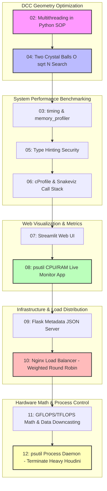

# Rebelway - Python For Production: Week 05 Report

## 1. Week Overview
- **Số lượng file .txt trong tuần này:** 13 file (bao gồm các bài học lý thuyết hiệu năng, các module tự động hóa hình học, lập trình web app/server, triển khai cân bằng tải và mô tả bài tập về nhà).
- **Chủ đề chính của tuần:**
  - **Tối ưu hóa hiệu năng & Đo lường (Profiling & Metrics):** Tìm hiểu cách viết Decorator đo thời gian thực thi chính xác bằng `time.monotonic()`, sử dụng `memory_profiler` để theo dõi RAM dòng theo dòng, và dùng `snakeviz` + `cProfile` để trực quan hóa Call Stack (lược đồ cuộc gọi hàm) nhằm tìm điểm nghẽn (bottleneck).
  - **Xử lý hình học song song & Giải thuật Duyệt đồ thị đồ họa (Parallel Geometry & Traversal):** Khai thác tối đa số nhân CPU bằng `ThreadPoolExecutor` để xử lý song song các điểm/primitive trong Houdini Python SOP. Tìm hiểu giải thuật **Two Crystal Balls (Square-Root Jump Search)** để duyệt mesh Hero cực nặng (hàng chục triệu polygon) nhằm tìm giao điểm/vùng tiếp xúc với mặt nước ($Y=0$) với độ phức tạp tối ưu $O(\sqrt{N})$.
  - **Type Hinting & Code Security:** Áp dụng Type Hints (khai báo kiểu dữ liệu tĩnh cho tham số và giá trị trả về của hàm) trong Python để cải thiện tính bảo mật, ngăn ngừa lỗi runtime do nghệ sĩ nhập sai kiểu dữ liệu.
  - **Web Frameworks & System Design (Streamlit, Flask, Nginx):**
    - Sử dụng **Streamlit** để nhanh chóng xây dựng dashboard hiển thị dữ liệu và công cụ giám sát tài nguyên hệ thống (CPU/RAM Monitor App sử dụng `psutil`).
    - Sử dụng **Flask** để xây dựng máy chủ backend nhỏ phục vụ nạp và lưu trữ metadata tài nguyên dạng JSON.
    - Cấu hình **Nginx** làm Load Balancer (Bộ cân bằng tải) sử dụng thuật toán **Weighted Round Robin** để điều phối yêu cầu từ máy trạm đến các cổng dịch vụ backend khác nhau tùy theo năng lực xử lý phần cứng.
  - **Quản lý tiến trình (Process Daemon):** Viết script chạy ngầm tự động giám sát các tiến trình đồ họa (như Houdini) và cưỡng bức tắt bằng lệnh `terminate()` khi RAM vượt ngưỡng an toàn để bảo vệ hệ thống không bị đóng băng.
- **Mục tiêu học tập chính:**
  - Làm chủ các công cụ đo lường hiệu năng chuyên sâu (`cProfile`, `snakeviz`, `memory_profiler`) để không còn "đoán mò" điểm nghẽn hiệu suất.
  - Hiểu cách chia nhỏ và chạy song song các tác vụ xử lý mesh trên nhiều nhân CPU, đồng thời biết cách áp dụng các thuật toán tìm kiếm tối ưu thay cho tìm kiếm tuyến tính $O(N)$ truyền thống trên dữ liệu mesh khổng lồ.
  - Nắm vững kiến thức hệ thống mạng cơ bản: Routing, REST API Methods (GET/POST), Load Balancing (Nginx), và ứng dụng các framework Python hiện đại để xây dựng các công cụ chia sẻ tài nguyên/giám sát trong pipeline của studio.

---

## 2. File-by-File Analysis

### 📄 File: 01_intro.txt

**Chủ đề chính:**
- Giới thiệu tổng quan nội dung tuần học 05.
- Concurrency (Đồng thời) trong việc xử lý hình học.
- Đo thời gian chạy hàm và sử dụng Python Profiler để tối ưu hóa chương trình.
- Lý thuyết về kiểu dữ liệu Static vs Dynamic trong lập trình.
- Giới thiệu các framework phát triển web: Streamlit và Flask.

**Nội dung chi tiết:**
- **Tóm tắt:** Bài học giới thiệu lộ trình học tập của tuần 5. Trọng tâm của tuần này là hiệu năng (Performance) và các tiện ích giám sát hệ thống (System Metrics). Học viên sẽ bắt đầu bằng cách học cách chạy song song các tác vụ tính toán hình học trên nhiều nhân CPU, viết các decorator đo thời gian và RAM, phân tích thuật toán duyệt mesh tối ưu. Sau đó học viên sẽ làm quen với việc thiết kế giao diện dạng trang web bằng Streamlit và máy chủ API bằng Flask, kết nối chúng để làm một dashboard giám sát tài nguyên máy tính hoặc máy chủ render farm theo thời gian thực.
- **Các khái niệm quan trọng:** Concurrency, Function timing, Geometry traversal algorithms, Static/Dynamic types, Python Profiler, Streamlit, Flask.
- **Dạng nội dung:** Tổng quan định hướng (Overview).

**Mức độ sâu:**
- 🟢 Nông / Chủ yếu khái niệm.

**Điểm nổi bật:**
- Định hình rõ ràng triết lý của tuần: Biến các lý thuyết lập trình mạng và khoa học máy tính chuyên sâu thành các ứng dụng cực kỳ thực tế trong sản xuất đồ họa.

**Điểm hạn chế / Thiếu sót:**
- Không có phần viết code vì là video giới thiệu.

**Liên quan đến Technical Artist (Houdini + VFX + AI):**
- **High** – Định hướng tư duy về hiệu suất hệ thống cho TA khi xử lý các file cảnh 3D nặng.

---

### 📄 File: 02_concurrency.txt

**Chủ đề chính:**
- Khái niệm Concurrency (lập trình đồng thời) trong xử lý hình học.
- Hạn chế của lập trình đơn luồng (Single-thread) mặc định của Python khi duyệt mesh.
- Sử dụng `ThreadPoolExecutor` từ thư viện `concurrent.futures` của Python.
- Tự động lấy số lượng core CPU hệ thống qua `os.cpu_count()`.
- Lập trình đa luồng chạy song song trong Houdini Python SOP.

**Nội dung chi tiết:**
- **Tóm tắt:** Giảng viên giải thích cấu trúc tệp hình học (như OBJ) thực chất là danh sách lớn chứa tọa độ đỉnh, normal và các liên kết mặt. Khi dùng Python thông thường để duyệt qua hàng triệu điểm để gán thuộc tính, Python chỉ chạy trên một nhân duy nhất, gây nghẽn cổ chai. Để tận dụng sức mạnh đa nhân của CPU, giảng viên hướng dẫn viết mã đa luồng trong node Python SOP của Houdini: lấy số nhân CPU hiện có (`os.cpu_count() - 1` để chừa lại 1 core cho hệ thống ổn định), khởi tạo một `ThreadPoolExecutor` và sử dụng `pool.submit()` để đẩy tác vụ gán thuộc tính `test` trên từng point vào các luồng chạy song song. Giảng viên cố tình đưa lệnh `time.sleep(4)` vào hàm gán thuộc tính để học viên có thể thấy rõ các point được xử lý đồng thời theo từng đợt (batch) bằng mắt thường trong viewport.
- **Các khái niệm quan trọng:** ThreadPoolExecutor, concurrent.futures, `os.cpu_count()`, CPU workers allocation, point attributes manipulation, multithreaded Python SOP.
- **Dạng nội dung:** Lập trình thực hành trong DCC (Houdini Python SOP coding).

**Mức độ sâu:**
- 🔴 Sâu / Rất kỹ thuật (Viết mã đa luồng can thiệp trực tiếp vào cấu trúc Point của Houdini geometry).

**Điểm nổi bật:**
- Nhấn mạnh rằng dù VEX trong Houdini mặc định là đa luồng, việc nắm vững cách viết Python đa luồng là cực kỳ quan trọng vì Python giúp TA kết nối với các hệ thống bên ngoài (CSV, database, web API) trong lúc đang xử lý mesh - điều mà VEX không thể làm được.

**Điểm hạn chế / Thiếu sót:**
- Chưa giải thích sự khác biệt sâu sắc giữa `ThreadPoolExecutor` (đa luồng) và `ProcessPoolExecutor` (đa tiến trình) trong ngữ cảnh vượt qua GIL của Python.

**Liên quan đến Technical Artist (Houdini + VFX + AI):**
- **High** – Cực kỳ quan trọng để tăng tốc các node Python SOP tùy chỉnh xử lý mesh phức tạp.

---

### 📄 File: 03_timing_and_memory.txt

**Chủ đề chính:**
- Phân chia công việc và quản lý nhóm Technical Artist (Git branching & worktrees).
- Viết Decorator đo thời gian thực thi hàm bằng `time.monotonic()`.
- Đo lường RAM tiêu thụ của hàm bằng thư viện `memory_profiler`.
- Sử dụng nhiều Decorator đồng thời trên một hàm.

**Nội dung chi tiết:**
- **Tóm tắt:** Đầu tiên, giảng viên chia sẻ kinh nghiệm quản lý đội ngũ TA: phân chia một công cụ lớn (như Asset Ingestion Tool) thành các nhánh tính năng nhỏ (unzip_utils, naming_checker, GUI/UX) cho từng thành viên phát triển trên các Git branch/worktree độc lập. Tiếp theo, giảng viên hướng dẫn viết một decorator `@timing` tùy chỉnh để đo thời gian thực thi của hàm: sử dụng `time.monotonic()` (tốt hơn `time.time()` vì không bị ảnh hưởng bởi việc cập nhật đồng hồ hệ thống). Sau đó, giảng viên cài đặt thư viện `memory_profiler` qua pip và áp dụng decorator `@profile` để in ra bảng thống kê lượng RAM tiêu thụ dòng theo dòng khi hàm chạy.
- **Các khái niệm quan trọng:** Git worktrees, Python Decorator, `time.monotonic()`, memory_profiler, `@profile` decorator, RAM profiling in MiB.
- **Dạng nội dung:** Lập trình thực hành tối ưu hóa hệ thống (System coding).

**Mức độ sâu:**
- 🟡 Trung bình (Giải thích chi tiết cách viết decorator và sử dụng thư viện memory_profiler thông qua ví dụ tính bình phương đơn giản).

**Điểm nổi bật:**
- Khuyên dùng `time.monotonic()` để benchmark thời gian thực thi một cách chính xác nhất trong khoa học máy tính.

**Điểm hạn chế / Thiếu sót:**
- Ví dụ minh họa chỉ chạy trên một vòng lặp toán học đơn giản, chưa áp dụng vào một hàm xử lý asset thực tế trong pipeline.

**Liên quan đến Technical Artist (Houdini + VFX + AI):**
- **High** – Giúp TA có công cụ chuẩn để đo đạc xem thuật toán mình viết có bị rò rỉ bộ nhớ (memory leak) hoặc chạy quá chậm hay không.

---

### 📄 File: 04_geometry_traversal.txt

**Chủ đề chính:**
- Ôn tập API Houdini về tạo thuộc tính (`addAttribute`) và tạo polygon (`createPolygon`).
- Vấn đề duyệt mesh Hero siêu nặng (ví dụ: asset 60 triệu polygon trong phim Avatar/Lion King).
- Giải thuật **Two Crystal Balls (Square-Root Jump Search)** để duyệt mesh.
- Tối ưu hóa thời gian tìm kiếm điểm giao cắt với mực nước từ $O(N)$ xuống $O(\sqrt{N})$.
- Sử dụng mảng NumPy để tăng tốc xử lý điểm trong Houdini Python SOP.

**Nội dung chi tiết:**
- **Tóm tắt:** Giảng viên hướng dẫn cách tạo hình học từ đầu bằng Python: tạo polygon rỗng, tạo point tại các tọa độ vector3, và add vertex kết nối chúng thành hình tam giác. Sau đó, giảng viên đưa ra bài toán thực tế: tìm những điểm trên một mesh núi đá Hero cực nặng nằm chính xác tại mực nước biển ($Y=0$). Nếu dùng vòng lặp tuyến tính thông thường thì độ phức tạp là $O(N)$, mesh 60 triệu polygon sẽ làm treo máy. Nếu dùng tìm kiếm nhị phân (Binary Search) thì khi phát hiện điểm bằng 0, thuật toán vẫn phải quét tuyến tính các phần tử lân cận để tìm ranh giới. Giảng viên triển khai thuật toán **Two Crystal Balls**: sử dụng bước nhảy bằng phần nguyên căn bậc hai của tổng số điểm ($jump = \lfloor \sqrt{N} \rfloor$). Luồng quét sẽ nhảy từng đoạn $jump$ phần tử. Khi phát hiện giá trị đạt $Y=0$ (True), thuật toán lùi lại 1 bước nhảy và bắt đầu quét tuyến tính một đoạn nhỏ tối đa là $jump$ phần tử để xác định chính xác ranh giới. Điều này giúp giảm số lượng phần tử cần kiểm tra đi rất nhiều, đưa độ phức tạp về $O(\sqrt{N})$.
- **Các khái niệm quan trọng:** Geometry creation API, Two Crystal Balls algorithm, Square-Root Jump Search, $O(\sqrt{N})$ complexity, Bounding box intersection, NumPy array in Houdini.
- **Dạng nội dung:** Lập trình thuật toán đồ họa nâng cao (Graphics algorithm coding).

**Mức độ sâu:**
- 🔴 Sâu / Rất kỹ thuật (Triển khai giải thuật tìm kiếm tối ưu hóa không gian trực tiếp trên cấu trúc dữ liệu hình học của Houdini).

**Điểm nổi bật:**
- Giải thích cực kỳ trực quan cách chuyển đổi một bài toán hình học 3D phức tạp (tìm điểm giao cắt nước) thành một bài toán tìm kiếm trên mảng 1D (Array of sorted heights) để áp dụng các giải thuật khoa học máy tính kinh điển.

**Điểm hạn chế / Thiếu sót:**
- Thuật toán yêu cầu danh sách các point của mesh đầu vào phải được sắp xếp theo thứ tự (ví dụ: theo chiều cao trục Y). Nếu point bị xáo trộn ngẫu nhiên, ta phải tốn thêm chi phí chạy thuật toán sắp xếp trước.

**Liên quan đến Technical Artist (Houdini + VFX + AI):**
- **High** – Cung cấp giải pháp thuật toán tối ưu hóa khi viết các tool Wrangle/Python tương tác với lượng dữ liệu mesh khổng lồ trong các dự án phim điện ảnh và game AAA.

---

### 📄 File: 05_static_and_dynamic_types.txt

**Chủ đề chính:**
- Quy chuẩn đặt tên biến nhất quán trong sản xuất (CamelCase vs snake_case).
- Khác biệt giữa ngôn ngữ định kiểu động (Dynamic: Python, JS) và định kiểu tĩnh (Static: C++, TypeScript).
- Rủi ro lỗi runtime trong các công cụ pipeline do tính chất định kiểu động của Python.
- Áp dụng **Type Hinting** trong Python để nâng cao độ an toàn của code.

**Nội dung chi tiết:**
- **Tóm tắt:** Giảng viên thảo luận về tầm quan trọng của tính nhất quán trong code (coding standards) khi làm việc nhóm. Tiếp theo, giảng viên phân tích sự khác nhau giữa ngôn ngữ Dynamic và Static. Python là ngôn ngữ động, cho phép gán tự do kiểu dữ liệu cho biến, điều này rất linh hoạt nhưng cực kỳ dễ phát sinh lỗi ẩn mà chỉ phát hiện được khi chạy chương trình (runtime). Để giải quyết việc này, giảng viên hướng dẫn cách áp dụng **Type Hinting** trong Python bằng cú pháp dấu hai chấm gán kiểu dữ liệu cho đối số và mũi tên gán kiểu dữ liệu trả về cho hàm (ví dụ: `def add(a: int, b: int) -> int:`). Nếu lập trình viên cố tình truyền vào kiểu dữ liệu khác (như float hay string), trình phân tích cú pháp (LSP) trong editor sẽ lập tức cảnh báo lỗi.
- **Các khái niệm quan trọng:** CamelCase vs snake_case, Dynamic vs Static typing, Type Hinting, Runtime errors, Code security & validation.
- **Dạng nội dung:** Quy chuẩn viết code và an toàn lập trình (Code architecture & Standards).

**Mức độ sâu:**
- 🟡 Trung bình (Giải thích rõ bản chất của Type Hinting và cách nó giúp ngăn ngừa lỗi gán sai biến trong các hàm quan trọng).

**Điểm nổi bật:**
- Liên hệ việc dùng Type Hinting trong Python tương đương với việc dùng TypeScript để giải quyết các nhược điểm của JavaScript thô, giúp xây dựng các công cụ hệ thống có tính tin cậy cao.

**Điểm hạn chế / Thiếu sót:**
- Python ở thời điểm chạy (runtime) vẫn không thực sự cưỡng bức kiểu dữ liệu (tức là code vẫn chạy và lỗi nếu có truyền sai kiểu), Type Hinting chủ yếu chỉ có tác dụng cảnh báo trong quá trình viết code (tĩnh). Học viên cần viết thêm code check `isinstance()` nếu muốn an toàn tuyệt đối ở runtime.

**Liên quan đến Technical Artist (Houdini + VFX + AI):**
- **High** – Cực kỳ cần thiết khi TA viết các hàm thư viện dùng chung cho cả studio (Core pipeline APIs) để đảm bảo các artist khác gọi hàm không truyền sai tham số gây sập hệ thống.

---

### 📄 File: 06_python_profiler.txt

**Chủ đề chính:**
- Phân tích hiệu năng chuyên sâu bằng Python Profiler.
- Trực quan hóa Call Stack bằng công cụ **Snakeviz**.
- Sử dụng module tích hợp sẵn `cProfile` để ghi nhận dữ liệu hiệu năng.
- Phân tích và phát hiện các hàm tốn nhiều thời gian chạy nhất trong lớp (class) phức tạp.

**Nội dung chi tiết:**
- **Tóm tắt:** Giảng viên giới thiệu công cụ profiling trực quan chuyên nghiệp dành cho Python là **Snakeviz**. Học viên cài đặt Snakeviz qua pip. Để thu thập dữ liệu, giảng viên sử dụng module `cProfile` chạy từ dòng lệnh: `python -m cProfile -o program.prof main.py`. File `.prof` xuất ra chứa chi tiết số lần gọi và thời gian thực thi của từng hàm trong chương trình. Khi chạy lệnh `snakeviz program.prof`, một giao diện web sẽ mở ra hiển thị biểu đồ Sunburst/Icicle trực quan hóa toàn bộ Call Stack. Nhìn vào biểu đồ này, lập trình viên lập tức thấy được hàm nào đang chiếm diện tích lớn nhất (tốn thời gian nhất) để tập trung tối ưu hóa hàm đó thay vì tối ưu hóa bừa bãi.
- **Các khái niệm quan trọng:** cProfile, snakeviz, Call Stack visualization, `.prof` profiling data, Performance bottleneck identification.
- **Dạng nội dung:** Hướng dẫn sử dụng công cụ đo lường hiệu năng (Profiling tools demo).

**Mức độ sâu:**
- 🟡 Trung bình (Hướng dẫn đầy đủ quy trình cài đặt, chạy cProfile và đọc biểu đồ Snakeviz trên một class quản lý thư viện sách đơn giản).

**Điểm nổi bật:**
- Cách tiếp cận khoa học: Sử dụng công cụ Snakeviz giúp việc đọc các báo cáo text khô khan của cProfile trở nên vô cùng dễ dàng và trực quan thông qua biểu đồ màu sắc.

**Điểm hạn chế / Thiếu sót:**
- Chưa hướng dẫn cách profiling các script chạy trực tiếp bên trong giao diện đồ họa của Houdini hoặc Maya.

**Liên quan đến Technical Artist (Houdini + VFX + AI):**
- **High** – Giúp TA nhanh chóng tìm ra dòng code hoặc node Python nào đang gây thắt nút cổ chai (bottleneck) trong một hệ thống script phức tạp của studio.

---

### 📄 File: 07_streamlit_intro.txt

**Chủ đề chính:**
- Giới thiệu triết lý phát triển web hiện đại: "HTML is the new EXE".
- Framework phát triển web ứng dụng **Streamlit** bằng Python.
- Cách hiển thị dữ liệu bảng Pandas DataFrame tự động trên web.
- Cách vẽ biểu đồ dữ liệu (`pyplot` / Matplotlib) trực tiếp trên web app.
- Xây dựng thanh công cụ bên (Sidebar) và các widget nạp file (`file_uploader`).

**Nội dung chi tiết:**
- **Tóm tắt:** Bài học giới thiệu một triết lý mới trong ngành công nghệ: thay vì phân phối file thực thi `.exe` cài đặt phức tạp, các công cụ hiện đại đang dịch chuyển lên chạy trực tiếp trên trình duyệt web dưới dạng các HTML/Web apps. **Streamlit** là một thư viện Python mạnh mẽ cho phép tạo nhanh các trang web tương tác chỉ bằng mã Python mà không cần biết HTML, CSS hay JavaScript. Giảng viên hướng dẫn viết một file `movies.py`, import `streamlit as st`, sử dụng `st.write()` để hiển thị bảng dữ liệu Pandas DataFrame (cho phép người dùng sắp xếp, tìm kiếm và tải về dạng CSV trực tiếp từ web), dùng `st.sidebar` để tạo thanh menu bên hông và nhúng widget `file_uploader` cho phép tải file CSV lên server.
- **Các khái niệm quan trọng:** HTML is the new EXE, Streamlit library, Pandas DataFrame rendering, pyplot visualization, sidebar widgets, file_uploader.
- **Dạng nội dung:** Lập trình ứng dụng web cơ bản (Web App development).

**Mức độ sâu:**
- 🟡 Trung bình (Giải thích kỹ triết lý thiết kế web app bằng Python và demo trực tiếp các widget cốt lõi của Streamlit).

**Điểm nổi bật:**
- Khả năng render bảng dữ liệu động cực kỳ nhanh chóng và tích hợp sẵn nút tải CSV giúp đơn giản hóa việc chia sẻ dữ liệu trong studio.

**Điểm hạn chế / Thiếu sót:**
- Mới chỉ demo tải file CSV thô, chưa có các xử lý dữ liệu phức tạp.

**Liên quan đến Technical Artist (Houdini + VFX + AI):**
- **High** – Giúp TA nhanh chóng tự làm các trang web nội bộ (Internal web dashboards) để trình bày kết quả, vẽ biểu đồ hiệu năng render farm hoặc phân tích dữ liệu dự án cho ban quản lý.

---

### 📄 File: 08_streamlit_monitor_app.txt

**Chủ đề chính:**
- Sử dụng các widget tương tác nâng cao trong Streamlit: `selectbox`, `slider`, `text_input`.
- Đọc và lọc dữ liệu CSV động dựa trên tương tác người dùng.
- Sử dụng thư viện `psutil` để truy vấn tài nguyên hệ thống (CPU, RAM).
- Xây dựng ứng dụng giám sát tài nguyên máy tính thời gian thực (Real-time System Monitor App) hiển thị biểu đồ đường chạy động (`add_rows`).
- Chạy trực tiếp app Streamlit từ file raw trên GitHub repository.

**Nội dung chi tiết:**
- **Tóm tắt:** Giảng viên nâng cấp ứng dụng Streamlit bằng cách thêm các widget tương tác: selectbox (hộp lựa chọn), slider (thanh trượt chọn khoảng số), và text_input (ô nhập chữ). Ứng dụng đọc file CSV sẽ lọc dữ liệu động theo giá trị của slider. Sau đó, giảng viên hướng dẫn xây dựng một ứng dụng hữu ích: **Machine Resources Monitor**. Sử dụng thư viện `psutil` để lấy phần trăm CPU đang dùng và phần trăm RAM ảo. Trong vòng lặp vô hạn `while True:`, script liên tục cập nhật dữ liệu này và vẽ biểu đồ đường động qua lệnh `cpu_chart.add_rows()` và `ram_chart.add_rows()`, sau đó ngủ 1 giây. Trang web sẽ hiển thị biểu đồ nhảy động thời gian thực rất mượt mà. Giảng viên cũng giới thiệu tính năng chạy app trực tiếp từ link file raw trên GitHub thông qua lệnh `streamlit run <URL>`.
- **Các khái niệm quan trọng:** Selectbox, Slider, psutil library, Real-time chart rendering (`add_rows`), Infinite loops in Streamlit, remote running from Git.
- **Dạng nội dung:** Lập trình ứng dụng giám sát thực tế (System Monitoring App).

**Mức độ sâu:**
- 🟡 Trung bình (Hướng dẫn kết nối thư viện hệ thống psutil với biểu đồ động của Streamlit để làm công cụ giám sát trực quan).

**Điểm nổi bật:**
- Khả năng cập nhật biểu đồ thời gian thực (real-time updating) chỉ bằng vài dòng code Python đơn giản mà không cần đụng đến WebSocket hay AJAX phức tạp của phát triển web truyền thống.

**Điểm hạn chế / Thiếu sót:**
- Vòng lặp `while True:` chạy vô hạn trong Streamlit cần được kiểm soát cẩn thận để tránh làm quá tải CPU của chính web server.

**Liên quan đến Technical Artist (Houdini + VFX + AI):**
- **High** – Ứng dụng trực tiếp để TA viết các dashboard giám sát tình trạng hoạt động của các máy trạm (Workstations) của artist hoặc các node trên render farm của studio.

---

### 📄 File: 09_flask_intro.txt

**Chủ đề chính:**
- So sánh các web framework trong Python: Django (nặng, phức tạp) vs Flask (nhẹ, linh hoạt).
- Vai trò của Python Web Server trong việc lưu trữ và phân phối asset 3D.
- Khởi tạo cấu trúc dự án web tiêu chuẩn (App root, `templates/` folder).
- Xây dựng Form nhập liệu bằng HTML và gửi dữ liệu qua phương thức POST.
- Viết API lưu trữ thông tin thuộc tính asset đồ họa sang file JSON (`json.dump`).

**Nội dung chi tiết:**
- **Tóm tắt:** Giảng viên giải thích rằng Streamlit che giấu toàn bộ backend (blackboxing), nên để làm chủ hoàn toàn hệ thống, ta cần tự xây dựng web server bằng **Flask**. Cấu trúc dự án gồm file chạy `app.py` và thư mục `templates/` chứa `form.html`. Trong `form.html`, viết một form HTML cơ bản nhận tên asset, polycount, ID và người dùng, gửi dữ liệu đi bằng phương thức POST. Trong `app.py`, giảng viên sử dụng decorator `@app.route('/submit', methods=['POST'])` để đón nhận dữ liệu gửi lên từ form, lưu trữ dữ liệu này thành một dictionary và ghi ra tệp cấu hình `asset_data.json` thông qua `json.dump()`.
- **Các khái niệm quan trọng:** Micro-framework Flask, HTML Form, POST method request, Routing decorators, `render_template()`, `request.form.get()`, JSON database writing.
- **Dạng nội dung:** Lập trình Backend Web Server (Backend development).

**Mức độ sâu:**
- 🟡 Trung bình (Xây dựng hoàn chỉnh một luồng gửi dữ liệu từ Form HTML ở frontend về xử lý ghi file JSON ở backend bằng Flask).

**Điểm nổi bật:**
- Hướng dẫn cấu trúc thư mục chuẩn và cách đón nhận dữ liệu từ các phương thức HTTP Request (POST) để ghi cơ sở dữ liệu dạng file.

**Điểm hạn chế / Thiếu sót:**
- Mã HTML của form viết rất thô sơ, không có CSS trang trí.

**Liên quan đến Technical Artist (Houdini + VFX + AI):**
- **High** – Cơ sở để TA xây dựng các cổng dịch vụ web API cục bộ để các công cụ trong Houdini/Maya gửi thông tin đăng ký asset mới lên cơ sở dữ liệu chung của studio.

---

### 📄 File: 10_flask_nginx_server.txt

**Chủ đề chính:**
- Khái niệm cân bằng tải (Load Balancing) trong thiết kế hệ thống (System Design).
- Khảo sát các thuật toán Load Balancing: Round Robin, Weighted Round Robin, Rendezvous Hashing.
- Sử dụng **Nginx** làm máy chủ Load Balancer.
- Chạy nhiều phiên bản web server Flask song song trên các Port khác nhau.
- Cấu hình file `nginx.conf` với block `upstream` để chia tải theo trọng số (weight).

**Nội dung chi tiết:**
- **Tóm tắt:** Khi số lượng yêu cầu tải asset hoặc render gửi từ hàng trăm máy trạm của artist lên server quá lớn, một máy chủ đơn lẻ sẽ bị quá tải. Giải pháp là sử dụng **Nginx** làm Load Balancer để điều phối tải. Giảng viên refactor một bài tập từ AlgoExpert sang Python: viết file `server.py` khởi chạy Flask app nhận biến cổng từ môi trường (`os.environ.get('PORT')`). Khởi chạy hai server song song: một server chạy trên Port 3000 và một server chạy trên Port 3001. Tiếp theo, cấu hình file `nginx.conf` của hệ thống: định nghĩa block `upstream python_backend` chứa cả 2 địa chỉ server, gán trọng số `weight=3` cho Port 3000 (biểu thị server này mạnh hơn gấp 3 lần). Thiết lập Nginx lắng nghe ở cổng 8081 và proxy pass về upstream. Khi dùng lệnh `curl` liên tục vào cổng 8081, Nginx sẽ tự động chia tải: khoảng 3/4 số yêu cầu được định tuyến về Port 3000 và 1/4 về Port 3001.
- **Các khái niệm quan trọng:** Load Balancer, Nginx configuration, Upstream server blocks, Proxy pass, Weighted Round Robin algorithm, environment PORT variables, Gunicorn/WSGI warning.
- **Dạng nội dung:** Quản trị hệ thống và triển khai máy chủ (DevOps & Server Deployment).

**Mức độ sâu:**
- 🔴 Sâu / Rất kỹ thuật (Cấu hình máy chủ reverse proxy thực tế và thiết lập phân chia tải trọng lượng trên hệ thống mạng).

**Điểm nổi bật:**
- Ứng dụng thực tế cao: Giúp TA hiểu cách phân phối tải cho các dịch vụ nặng như xuất file cache, chạy simulation từ xa, hay phân phối file texture chất lượng cao.

**Điểm hạn chế / Thiếu sót:**
- Nginx config trên hệ điều hành Windows có cách thiết lập và khởi chạy dịch vụ phức tạp hơn so với macOS/Linux vốn dùng brew/systemctl.

**Liên quan đến Technical Artist (Houdini + VFX + AI):**
- **High** – Kiến thức nền tảng để TA phối hợp với bộ phận IT/Pipeline để thiết kế hạ tầng server phân phối asset hoặc render farm chịu tải lớn cho studio.

---

### 📄 File: 11_gflops_tflops.txt

**Chủ đề chính:**
- Khái niệm toán học Big O nâng cao: Phức tạp phụ thuộc đa biến $O(A \cdot B)$, lược bỏ hằng số để giữ nguyên $O(1)$.
- Khái niệm FLOP (Floating Point Operation), GFLOP ($10^9$ FLOPs) và TFLOP ($10^{12}$ FLOPs).
- Công thức tính FLOPs cho phép nhân ma trận $N \times N$: $2N^3$.
- Đo lường GFLOPS/TFLOPS thực tế của CPU bằng phép nhân ma trận NumPy.
- Tối ưu hóa hiệu năng bằng cách giảm độ chính xác của kiểu dữ liệu (Float32 -> Float16 / Int8).

**Nội dung chi tiết:**
- **Tóm tắt:** Bài học giải thích cách đo đạc năng lực tính toán thực tế của phần cứng bằng GFLOPS (tỷ phép tính số thực dấu phẩy động trên giây). Giảng viên đưa ra công thức tính toán số lượng phép tính số thực cho phép nhân ma trận vuông kích thước $N \times N$: $FLOP = 2N^3$ (vì mỗi phần tử trong ma trận kết quả yêu cầu $N$ phép nhân và $N$ phép cộng). Giảng viên viết script `performance_metrics.py` tạo hai ma trận ngẫu nhiên lớn bằng NumPy kích thước $4096 \times 4096$ kiểu dữ liệu `np.float32`. Thực hiện đo thời gian nhân ma trận bằng `time.monotonic()` và tính toán số GFLOPS đạt được bằng công thức: `GFLOPS = (FLOP / time_duration) / 1e9`. Để tối ưu hiệu năng, giảng viên biểu diễn việc hạ độ chính xác (downcasting) kiểu dữ liệu từ float32 sang int8 (8-bit integer). Kết quả là thời gian chạy giảm mạnh và lượng tài nguyên tính toán (GFLOPs tiêu thụ) giảm đi đáng kể.
- **Các khái niệm quan trọng:** FLOPs calculation formula ($2N^3$), GFLOPS vs TFLOPS unit scales, Floating point precision downcasting, mixed precision, integer quantization (Int8), CPU benchmark.
- **Dạng nội dung:** Benchmark hiệu năng và lập trình toán học (Performance benchmark & Math coding).

**Mức độ sâu:**
- 🔴 Sâu / Rất kỹ thuật (Đi sâu vào lý thuyết phần cứng máy tính và toán ma trận để đo đạc và so sánh hiệu suất tính toán thô).

**Điểm nổi bật:**
- Cung cấp hiểu biết sâu sắc về Mixed Precision (độ chính xác hỗn hợp) và Quantization (lượng tử hóa) - các kỹ thuật cốt lõi giúp tăng tốc độ xử lý đồ họa thời gian thực và tối ưu hóa việc chạy các mô hình AI/Deep Learning trên các thiết bị có tài nguyên giới hạn.

**Điểm hạn chế / Thiếu sót:**
- Phép nhân ma trận trong NumPy mặc định chạy trên CPU (thông qua thư viện BLAS/MKL), bài học chưa demo phép tính này chạy trên nhân CUDA của GPU vốn là nơi xử lý FLOPs chính trong VFX/AI.

**Liên quan đến Technical Artist (Houdini + VFX + AI):**
- **High** – Cực kỳ quan trọng cho các TA làm việc trong lĩnh vực tối ưu hóa Game Engine hoặc huấn luyện và triển khai các mô hình AI (như tạo texture bằng AI, xử lý ảnh) trên máy artist.

---

### 📄 File: 12_terminate_heavy_process.txt

**Chủ đề chính:**
- Rủi ro sập RAM và đứng máy do các thuật toán xử lý đồ họa thô bạo (ví dụ: subdivide sphere 10 lần).
- Công cụ giám sát tiến trình hệ điều hành: `htop`, `nvidia-smi`, `asitop`.
- Viết Daemon Script chạy ngầm bằng `psutil` để kiểm tra dung lượng RAM của tiến trình Houdini.
- Cưỡng bức tắt tiến trình an toàn bằng phương thức `terminate()`.
- Lập trình bắt lỗi tiến trình (`psutil.NoSuchProcess`).

**Nội dung chi tiết:**
- **Tóm tắt:** Trong quá trình làm việc, artist rất dễ vô tình nhấn nhầm các thông số (ví dụ: chia nhỏ lưới quá nhiều lần, tăng cỡ particle quá lớn) làm ngốn hàng chục GB RAM ngay lập tức, gây treo máy trạm. Để tránh việc phải reset máy vật lý từ xa, giảng viên hướng dẫn viết một script Python chạy ẩn làm nhiệm vụ giám sát (Process Daemon). Sử dụng `psutil.process_iter()` để duyệt qua tất cả tiến trình đang chạy, lọc ra các tiến trình có tên chứa `'houdini'` hoặc `'haprentice'` (bản Apprentice). Lấy chỉ số RAM vật lý đang chiếm dụng thực tế qua thuộc tính `rss` và quy đổi ra GB. Nếu dung lượng RAM của Houdini vượt quá mức quy định (ví dụ: 10GB hoặc 30GB), daemon script lập tức gọi phương thức `proc.terminate()` để buộc tắt Houdini ngay lập tức để giải phóng RAM cho hệ thống. Giảng viên demo trực quan việc subdivision lưới 10 lần trong Houdini làm RAM vọt lên 45GB, và daemon script lập tức nhận diện rồi kill Houdini chỉ sau 2 giây.
- **Các khái niệm quan trọng:** Process Daemon, psutil process iterator, RSS (Resident Set Size), RAM limit threshold, process termination, SIGTERM vs SIGKILL, infinite loop monitoring.
- **Dạng nội dung:** Lập trình tiện ích hệ thống và bảo vệ hạ tầng (System administration script).

**Mức độ sâu:**
- 🟡/🔴 Trung bình đến Sâu (Viết script daemon tự động can thiệp sâu vào quyền quản lý tiến trình của hệ điều hành để bảo vệ tài nguyên phần cứng).

**Điểm nổi bật:**
- Giải pháp rất thực tế giúp ngăn chặn tình trạng đứng máy trạm của artist khi họ làm việc với các file simulation hoặc mesh quá nặng, tiết kiệm thời gian vận hành cho bộ phận hệ thống.

**Điểm hạn chế / Thiếu sót:**
- Việc tắt đột ngột tiến trình (`proc.terminate()`) sẽ làm artist mất toàn bộ dữ liệu chưa kịp lưu. Nên kết hợp thêm các cảnh báo giao diện hoặc lưu tạm file tự động nếu có thể.

**Liên quan đến Technical Artist (Houdini + VFX + AI):**
- **High** – Giúp TA viết các công cụ quản lý máy trạm thông minh hoặc tự động kiểm soát render farm nodes để tự giải phóng bộ nhớ khi có task render bị rò rỉ RAM (RAM leak).

---

### 📄 File: 13_assignment.txt

**Chủ đề chính:**
- Yêu cầu của bài tập về nhà Week 05.
- Fetch dữ liệu từ API bên ngoài (JSONPlaceholder) bằng thư viện `requests`.
- Xây dựng giao diện web động bằng Streamlit.
- Cập nhật hiển thị động (wiping & refreshing) dữ liệu trên web mỗi 5 giây.
- Vòng lặp tuần hoàn (loop back) hiển thị dữ liệu cho đến khi dừng server.

**Nội dung chi tiết:**
- **Tóm tắt:** Bài tập tuần này yêu cầu học viên xây dựng một trang web bằng Streamlit kết hợp lập trình mạng API:
  - Gửi yêu cầu HTTP GET đến endpoint `/posts` của JSONPlaceholder API để lấy về danh sách các bài viết dạng JSON.
  - Trên giao diện Streamlit, không hiển thị toàn bộ danh sách mà chỉ hiển thị nội dung (title, body) của bài viết đầu tiên.
  - Cứ sau mỗi 5 giây, trang web phải tự động làm mới giao diện và chuyển sang hiển thị bài viết tiếp theo.
  - Khi hiển thị đến bài viết thứ 4 (hoặc cuối danh sách thiết lập), ứng dụng phải tự động quay vòng (loop back) về hiển thị bài viết thứ nhất.
  - Chu kỳ này chạy lặp vô hạn cho đến khi người dùng tắt web server.
- **Các khái niệm quan trọng:** HTTP GET request, JSONPlaceholder API, Streamlit dynamic refresh, time loop, interface wiping, cyclic list traversal.
- **Dạng nội dung:** Mô tả bài tập về nhà (Assignment specification).

**Mức độ sâu:**
- 🟢 Nông / Khái niệm (Đề bài tập tự thực hành).

**Điểm nổi bật:**
- Kết hợp hoàn hảo kỹ năng lập trình API mạng với việc quản lý vòng lặp cập nhật giao diện của Streamlit, giúp củng cố kiến thức tối ưu hóa hiệu suất thời gian thực.

**Điểm hạn chế / Thiếu sót:**
- Không có mã nguồn hay gợi ý giải pháp cụ thể.

**Liên quan đến Technical Artist (Houdini + VFX + AI):**
- **High** – Rèn luyện kỹ năng viết các dashboard hiển thị thông tin động (như live logs, live status của task) cho TA.

---

## 3. Weekly Summary (Tổng kết Week 05)

### 3.1. Các chủ đề/công nghệ cốt lõi
- **Concurrency & Đa luồng trong DCC:** Sử dụng `ThreadPoolExecutor` của thư viện `concurrent.futures` để phân chia và xử lý song song dữ liệu Point/Primitive trên nhiều core CPU của máy trạm.
- **Giải thuật duyệt đồ thị đồ họa tối ưu:** Sử dụng giải thuật **Two Crystal Balls** (Square-Root Jump Search) với độ phức tạp $O(\sqrt{N})$ để quét tìm các điểm đặc thù trên lưới triệu polygon mà không làm sập hệ thống do duyệt tuyến tính $O(N)$.
- **Type Hinting & Code Quality:** Định kiểu dữ liệu tĩnh cho tham số hàm để tạo tính tin cậy cao cho code pipeline, loại bỏ các lỗi runtime ngớ ngẩn do artist truyền sai kiểu dữ liệu.
- **Profiling & Benchmarking:**
  - Viết decorator đo thời gian thực thi chính xác bằng `time.monotonic()`.
  - Sử dụng `memory_profiler` đo RAM dòng theo dòng.
  - Sử dụng `cProfile` và **Snakeviz** trực quan hóa call stack để săn lùng hàm thắt nút cổ chai.
- **Streamlit & Real-time Dashboards:** Xây dựng web app nhanh chóng bằng Streamlit, dùng `psutil` để vẽ biểu đồ giám sát hiệu suất CPU/RAM thời gian thực.
- **Flask Backend & Load Balancing:** Xây dựng web server Flask và cấu hình **Nginx** reverse proxy chia tải trọng số (Weighted Round Robin) giữa các cụm cổng backend.
- **Process Daemon:** Lập trình kịch bản tự động kiểm soát tài nguyên tiến trình đồ họa và cưỡng bức giải phóng RAM khi vượt ngưỡng nguy hiểm.

### 3.2. Mối liên hệ và sự tiến triển của kiến thức qua từng file
- **Phần 1: Parallel Processing & Thuật toán Hình học (Files 02, 04):** Học viên được tiếp cận trực tiếp với việc giải quyết các bài toán mesh cực nặng trong Houdini bằng cách kết hợp song song hóa phần cứng (đa luồng CPU) và tối ưu hóa giải thuật phần mềm (Square-root search thay thế cho Linear search).
- **Phần 2: Phân tích & Đo đạc hiệu năng (Files 03, 05, 06):** Sau khi đã hiểu thế nào là tối ưu, học viên học cách tự chế tạo các công cụ đo đạc (Timing decorator, Memory profiler, Snakeviz call stack) để kiểm chứng mã nguồn của mình có thực sự tốt hay không, đồng thời áp dụng Type Hinting để gia cố an toàn cho mã.
- **Phần 3: Web App Frontend & Resource Monitoring (Files 07, 08):** Chuyển dịch từ console/DCC sang trình duyệt web. Học viên sử dụng Streamlit để vẽ biểu đồ và trực quan hóa các chỉ số hiệu năng đã thu thập được từ hệ thống bằng thư viện `psutil`.
- **Phần 4: Server backend & Hệ thống phân phối tải (Files 09, 10):** Tìm hiểu sâu xuống hạ tầng mạng bằng cách xây dựng web server Flask nhận dữ liệu asset thô và cấu hình Nginx làm bộ cân bằng tải Weighted Round Robin để phân phối tải thông minh trong hệ thống studio lớn.
- **Phần 5: Tính toán toán học thô & Tự động bảo vệ hệ thống (Files 11, 12):** Đo đạc hiệu suất phần cứng bằng GFLOPS thông qua toán ma trận NumPy và độ chính xác dữ liệu (float/int precision), đồng thời viết tool daemon tự động dọn dẹp các tiến trình làm nghẽn RAM để giữ máy trạm luôn an toàn.

### 3.3. Ứng dụng thực tế và vai trò của Technical Artist (TA)
- **Tối ưu hóa các công cụ mô phỏng/mesh nặng:** Bằng cách áp dụng đa luồng trong Python SOP và thuật toán nhảy căn bậc hai (Two Crystal Balls), TA có thể viết ra các bộ lọc lưới, tính toán biến dạng da (deformer), hoặc tạo thuộc tính (attributes) chạy nhanh hơn gấp nhiều lần trên các nhân vật Hero hoặc cảnh môi trường khổng lồ.
- **Xây dựng các công cụ báo cáo hiệu năng của Studio (Pipeline Diagnostics):** Kết hợp Streamlit và `psutil` để dựng nhanh các trang web chẩn đoán lỗi phần cứng, nhiệt độ server, hoặc thống kê thời gian render của các artist để báo cáo cho Lead/Manager.
- **API hóa các dịch vụ đồ họa (DCC Web Services):** Viết các backend Flask nhỏ chạy ngầm trên render farm hoặc server trung tâm của studio để nhận yêu cầu từ xa, tự động nạp Houdini headless (`hython`) để bake texture, remesh hoặc xuất file định dạng USD/FBX rồi gửi trả kết quả qua giao diện web.
- **Tự động bảo vệ máy trạm của artist:** Triển khai các daemon script giám sát trên máy trạm của artist để tự động phát hiện và tắt các tiến trình rò rỉ RAM (như render bị lỗi loop vô hạn) trước khi làm sập máy vật lý, giảm số lượng ticket cứu hộ gửi cho bộ phận IT.

### 3.4. Các lỗi/hạn chế phổ biến và giải pháp khắc phục
1. **Hiệu ứng GIL (Global Interpreter Lock) làm hạn chế Threading trong Python:**
   * *Nguyên nhân:* Nhiều học viên lầm tưởng dùng `ThreadPoolExecutor` sẽ chạy song song thực sự trên nhiều core CPU cho các tác vụ tính toán nặng. Thực tế, GIL của Python chỉ cho phép một luồng chạy tại một thời điểm đối với các tác vụ thuần túy CPU-bound.
   * *Giải pháp:* Đối với các tác vụ tính toán toán học nặng (CPU-bound), hãy chuyển sang sử dụng `ProcessPoolExecutor` (tạo ra các tiến trình Python độc lập có bộ nhớ riêng để vượt qua GIL) hoặc sử dụng các thư viện C-extension như NumPy vốn giải phóng GIL trong lúc tính toán ma trận.
2. **Lỗi sập RAM mất dữ liệu khi daemon script kill tiến trình:**
   * *Nguyên nhân:* Lệnh `proc.terminate()` gửi tín hiệu SIGTERM để tắt phần mềm ngay lập tức, khiến artist bị mất toàn bộ công việc chưa kịp lưu khi file simulation bị tràn RAM.
   * *Giải pháp:* Thay vì tắt ngay lập tức, hãy thiết lập script gửi cảnh báo trước thông qua các ứng dụng chat (như Slack/Discord webhook) hoặc giao diện popup, hoặc cấu hình tín hiệu SIGTERM để Houdini kích hoạt tính năng tự động lưu file cứu hộ (Crash recovery file `.crash.hip`) trước khi thoát.
3. **Nginx không khởi động được do xung đột cổng (Port conflict) trên Windows:**
   * *Nguyên nhân:* Cổng 80 hoặc cổng được thiết lập trong cấu hình Nginx bị chiếm dụng bởi các dịch vụ hệ thống khác (như IIS của Windows).
   * *Giải pháp:* Thay đổi cổng lắng nghe trong file `nginx.conf` sang một cổng ngẫu nhiên không trùng lặp (ví dụ: 8081 hoặc 8085) và chạy lại Nginx bằng quyền Administrator.
4. **Lớp `Lazy` không thể nhân bản trạng thái biến:**
   * *Nguyên nhân:* Việc trì hoãn đánh giá biến bằng Lazy evaluation có thể dẫn đến việc giá trị đầu vào của biến bị thay đổi trước khi lệnh `force()` được gọi, dẫn đến kết quả tính toán cuối cùng bị sai lệch.
   * *Giải pháp:* Đảm bảo các tham số đầu vào được đóng băng (immutable hoặc copy giá trị tại thời điểm khai báo) bên trong constructor của lớp `Lazy`.
