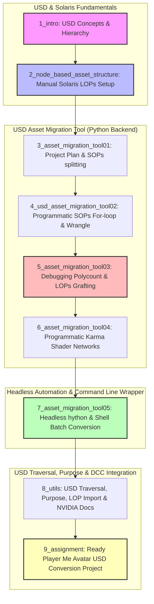

# Rebelway - Python For Production: Week 06 Report

## 1. Week Overview
- **Số lượng file .txt trong tuần này:** 10 file (bao gồm các bài học lý thuyết cơ bản về USD, cách hoạt động của Solaris/LOPs, và quy trình xây dựng công cụ chuyển đổi asset Legacy sang USD tự động bằng Python + Shell Script).
- **Chủ đề chính của tuần:**
  - **Giới thiệu USD & Hệ thống phân cấp (USD Concepts & Hierarchy):** Tìm hiểu lý thuyết Universal Scene Description (USD) được phát triển bởi Pixar, cách tổ chức scene graph theo chuẩn công nghiệp: `Assembly` (Cảnh lắp ráp) -> `Group` (Nhóm vật thể) -> `Component` (Tài nguyên lá đơn lẻ) -> `Sub-component` (Chi tiết bên trong). Phân biệt giữa các loại prim Xform (cho phép biến đổi vị trí) và Scope (chỉ gom nhóm tĩnh).
  - **Lập trình mạng hình học Solaris SOPs (Programmatic SOPs inside LOPs):** Sử dụng Python để tự động hóa việc tạo node `Sub Create LOP`. Đi sâu vào SOP context để import file hình học Legacy (OBJ/FBX), phân tách mesh dựa trên thuộc tính `shop_materialpath` thông qua cấu trúc For-loop SOPs được khởi tạo hoàn toàn bằng code Python.
  - **Tối ưu hóa hiệu năng & Debug lỗi phình to Polycount:** Phân tích và khắc phục lỗi nghẽn hiệu năng nghiêm trọng (Performance Trap) khi thiết lập sai thông số `method` của Block Begin node trong vòng lặp Python SOP, giúp ngăn chặn hiện tượng nhân bản lưới làm tăng dung lượng cảnh lên gấp nhiều lần.
  - **Tự động hóa lập trình mạng vật liệu Karma (Programmatic Karma Shaders):** Lập trình tạo tự động các slot vật liệu trên node Material Library LOP, tạo Karma Material Builder (subnet), quét thư mục tìm tệp texture màu phù hợp, kết nối cổng shader động bằng phương thức `inputIndex()` / `outputIndex()` và kích hoạt cờ Material Flag của subnet bằng `setMaterialFlag(True)`.
  - **Tự động hóa Headless & Batch Processing (hython & Shell Scripting):** Viết script Python chạy độc lập (`run_on_template.py`) nạp file `.hip` mẫu và thực thi xử lý tài nguyên không qua giao diện người dùng. Bọc ngoài bằng shell script (`batch_process_usd_assets.sh`) chạy vòng lặp quét qua toàn bộ các thư mục asset trên server để tự động chuyển đổi hàng loạt sang tệp USD.
  - **Duyệt đồ thị USD (USD Traversal & Purpose):** Sử dụng API `stage.Traverse()` để duyệt cây phân cấp USD phục vụ debug và kiểm tra scene. Tìm hiểu khái niệm `Purpose` trong USD (Render, Proxy, Guide) để tối ưu hiển thị viewport.
- **Mục tiêu học tập chính:**
  - Nắm vững triết lý thiết kế và hệ thống thuật ngữ phân cấp của USD (DCC-agnostic packaging system).
  - Làm chủ kỹ năng lập trình Python để tự động hóa việc xây dựng, kết nối dây cáp và cấu hình các node hình học cũng như shader Karma trong ngữ cảnh Solaris (LOPs).
  - Biết cách kết hợp script Python trong Houdini với lệnh gọi headless (`hython`) và Bash/PowerShell script để xây dựng một pipeline chuyển đổi tài nguyên tự động hoàn chỉnh cho studio.

---

## 2. File-by-File Analysis

### 📄 File: 00_intro.txt

**Chủ đề chính:**
- Giới thiệu tổng quan nội dung tuần học Week 06.
- Mục tiêu xây dựng công cụ chuyển đổi tài nguyên legacy sang USD.
- Quản lý cấu trúc phân cấp (hierarchy) USD.
- Lập trình tạo và kết nối mạng vật liệu Karma bằng Python.
- Viết script xử lý hàng loạt (batch process) các asset trên server.

**Nội dung chi tiết:**
- **Tóm tắt:** Bài học giới thiệu lộ trình học tập của Week 06. Giảng viên nêu rõ tuần học này không tập trung vào hướng dẫn sử dụng USD cơ bản, mà đi sâu vào một bài tập thực tế lớn: xây dựng một USD Asset Migration Tool để chuyển đổi các asset từ pipeline cũ (Legacy) sang USD pipeline mới. Nội dung bao gồm việc tìm hiểu thuật ngữ và phân cấp USD, lập trình Python tạo dựng cấu trúc LOPs trong Houdini, tạo shader Karma và gán texture tự động, và viết script shell/python để quét và xử lý hàng loạt thư mục chứa asset thô trên server.
- **Các khái niệm quan trọng:** USD Asset Migration Tool, USD Hierarchy, Karma material network creation with Python, batch processing, shell script wrapper.
- **Dạng nội dung:** Tổng quan định hướng (Overview).

**Mức độ sâu:**
- 🟢 Nông / Chủ yếu khái niệm.

**Điểm nổi bật:**
- Nhấn mạnh khía cạnh thực chiến: Chuyển đổi tự động hóa tài nguyên legacy thay vì làm thủ công, giúp tiết kiệm hàng ngàn giờ lao động cho nghệ sĩ khi studio chuyển đổi sang USD pipeline.

**Điểm hạn chế / Thiếu sót:**
- Video ngắn mang tính chất giới thiệu, chưa đi vào chi tiết kỹ thuật hay viết mã.

**Liên quan đến Technical Artist (Houdini + VFX + AI):**
- **High** – Định hình rõ ràng vai trò của TA trong việc thiết kế công cụ chuyển đổi và quản trị tài nguyên của studio.

---

### 📄 File: 1_intro (1440p).txt

**Chủ đề chính:**
- Định nghĩa USD (Universal Scene Description) và lịch sử phát triển bởi Pixar.
- Lý do USD trở thành tiêu chuẩn vàng DCC-agnostic của ngành VFX/Animation.
- Cấu trúc phân cấp tài nguyên USD (Asset hierarchy): Assembly, Group, Component, Sub-component.
- Giao diện Stage (Solaris / LOPs) trong Houdini và các bảng scene graph tree/details.
- Khái niệm Core của USD: Layers, Opinions strength, Prim path và Xform vs Scope.

**Nội dung chi tiết:**
- **Tóm tắt:** Giảng viên giới thiệu chi tiết về định dạng USD. Các studio lớn trước đây đều tự phát triển hệ thống đóng gói asset tùy chỉnh (custom packaging) gây tốn kém tiền bạc và khó trao đổi dữ liệu chéo DCC. Pixar đã giải quyết vấn đề này bằng cách tạo ra USD - một định dạng hoạt động mượt mà giữa Maya, Houdini, Blender và game engines. Bản chất USD hoạt động như một hệ thống quản lý con trỏ (pointer manipulation) trỏ tới các tệp thực tế trên ổ đĩa. Giảng viên giải thích cách tổ chức phân cấp một scene USD lớn (như Kitchen scene của Pixar) thông qua 4 cấp độ: Assembly (cụm scene lớn như cả căn bếp), Group (nhóm vật thể như bàn ăn, tủ lạnh), Component (asset lá đơn lẻ như cái đĩa), Sub-component (các chi tiết trong component như thức ăn trên đĩa). Cuối cùng, giảng viên hướng dẫn làm quen với giao diện Solaris (Stage context) trong Houdini: Scene Graph Tree, Scene Graph Details, phân biệt Xform (cho phép transform) và Scope (chỉ gom nhóm tĩnh), cách chỉ định đường dẫn Path `/main_scene/box` để sắp xếp phân cấp và cách dùng cú pháp `@` để wrap đường dẫn file USD tham chiếu ngoài.
- **Các khái niệm quan trọng:** USD DCC-agnostic, pointer referencing, Assembly vs Group vs Component vs Sub-component, Solaris context, Scene Graph Details, Layers, Opinions strength, Xform vs Scope, `@path_to_file@`.
- **Dạng nội dung:** Lý thuyết cơ bản và làm quen giao diện trong DCC (USD & Solaris introduction).

**Mức độ sâu:**
- 🟡/🔴 Trung bình đến Sâu (Giải thích rất kỹ triết lý của USD, cách phân loại kind và cách hoạt động của scene graph).

**Điểm nổi bật:**
- Sử dụng phép so sánh trực quan: Hệ thống Layer của USD hoạt động giống như các layer trong Photoshop giúp ghi đè thuộc tính (overrides) mà không làm hỏng dữ liệu gốc. Giải thích triệt để khái niệm "Opinions" (mỗi phòng ban Lighting, FX có một tiếng nói, bên nào có opinion mạnh hơn sẽ override transform/shader).

**Điểm hạn chế / Thiếu sót:**
- Bài giảng mang tính lý thuyết tổng quan, chưa hướng dẫn viết code Python USD API thô (như thư viện `pxr.Usd`) mà chỉ thao tác qua giao diện UI của Solaris.

**Liên quan đến Technical Artist (Houdini + VFX + AI):**
- **High** – Đây là kiến thức nền tảng bắt buộc phải có cho mọi TA làm việc trong các studio hiện đại sử dụng Solaris/LOPs và USD pipeline.

---

### 📄 File: 2_node_based_asset_structure.txt

**Chủ đề chính:**
- Sử dụng Primitive LOP để tạo container rỗng và gán Kind trong Solaris.
- Sử dụng Sub Create LOP để tạo hình học từ SOP context bên trong LOPs.
- Cấu hình phân cấp mesh thủ công với Graph Stages LOP (Parent-Child relationship).
- Thiết lập cấu trúc phân cấp chuẩn: Assembly -> Group -> Component -> Sub-component -> Mesh.
- Phân biệt sự khác biệt về mặt hiển thị của các layer hoạt động (Active Layers) qua màu sắc.

**Nội dung chi tiết:**
- **Tóm tắt:** Bài học hướng dẫn xây dựng cấu trúc phân cấp USD thủ công bằng cách sử dụng các node trong Solaris để làm quen với logic hoạt động trước khi viết code. Giảng viên khởi tạo một `Primitive LOP` đóng vai trò là một container rỗng, gán Kind cho nó. Sau đó, giảng viên dùng node `Sub Create LOP` để đi vào SOP context tạo hình học thô gồm hai box đại diện cho `house_base` và `house_top`, gán thuộc tính tên và đường dẫn (`/house_base_geom` và `/house_top_geom`) rồi merge lại. Quay lại LOPs, giảng viên sử dụng node `Graph Stages LOP` để kết nối Primitive LOP (đầu vào 1 - Parent) và Sub Create LOP (đầu vào 2 - Children). Qua đó, cấu trúc `Component -> Sub-component -> Mesh` được tạo ra. Giảng viên nhân bản cấu trúc này thành ngôi nhà thứ hai (`second_house`), gộp cả hai ngôi nhà lại và đặt dưới một primitive cha là `city_block` có Kind là `Assembly`.
- **Các khái niệm quan trọng:** Primitive LOP, Sub Create LOP, Graph Stages LOP, active layers color code, Kind assignment (Assembly, Group, Component, Sub-component).
- **Dạng nội dung:** Thực hành thao tác node trong Solaris LOPs.

**Mức độ sâu:**
- 🟡 Trung bình (Hướng dẫn chi tiết cách tổ chức cây thư mục Scene Graph đúng chuẩn thông qua các node LOPs cốt lõi).

**Điểm nổi bật:**
- Giải thích cách thiết kế đường dẫn Mesh trong SOPs (sử dụng dấu gạch chéo `/`) để khi kết nối với Graph Stages LOP, geometry sẽ tự động trở thành các lá phẳng (flat children) bên trong container sub-component cha, giúp giữ scene graph gọn gàng.

**Điểm hạn chế / Thiếu sót:**
- Toàn bộ bài thực hành được thực hiện bằng cách kéo thả node thủ công, chưa giới thiệu API Python tương đương để tạo các cấu trúc này.

**Liên quan đến Technical Artist (Houdini + VFX + AI):**
- **High** – TA cần hiểu rõ cách thức tổ chức cây Scene Graph bằng node trong Solaris thì mới có thể viết script tự động hóa chính xác cấu trúc này.

---

### 📄 File: 3_asset_migration_tool01.txt

**Chủ đề chính:**
- Phân chia nhánh Git chuyên nghiệp trong phát triển phần mềm studio (fix/, feature/, experiment/).
- Nhu cầu thực tế của việc tự động hóa chuyển đổi asset Legacy sang USD (USD Ingestion Pipeline).
- Khảo sát cấu trúc của tệp FBX Legacy (gồm các phần mesh rời rạc: leaves, trunk, twigs, small leaves).
- Chiến lược phân tách geometry trong SOPs bằng vòng lặp dựa trên thuộc tính `shop_materialpath`.
- Phác thảo thiết kế của USD Migration Tool kết hợp Python và Houdini LOPs.

**Nội dung chi tiết:**
- **Tóm tắt:** Đầu tiên, giảng viên giảng giải về cách đặt tên nhánh Git chuyên nghiệp trong studio: thay vì đặt tên tùy tiện, cần gom nhóm theo mục đích (ví dụ: `fix/bone_structure`, `feature/ai_skeleton`, `experiment/formats`) và viết mô tả PR thật chi tiết. Tiếp theo, giảng viên giới thiệu dự án chính: xây dựng công cụ Python chuyển đổi các file hình học cũ (như FBX/OBJ) thành USD asset. Tệp FBX của cây mẫu chứa các mesh rời rạc với tên thuộc tính lộn xộn. Giảng viên sử dụng node For-Each loop trong SOPs chạy trên thuộc tính `shop_materialpath` để cô lập từng cụm geometry tương ứng với vật liệu (lá, thân, cành). Giảng viên giải thích cách dùng attribute delete để lọc sạch các thuộc tính rác không cần thiết nhằm tối ưu dung lượng tệp USD đầu ra. Cuối cùng, giảng viên giới thiệu thư viện vật liệu Karma và Karmamaterialbuilder để dựng shader cơ bản sử dụng tệp texture màu.
- **Các khái niệm quan trọng:** Git branching structure, Legacy assets ingestion, `shop_materialpath` attribute, For-each loop by attribute, attribute cleanup, Karma material library.
- **Dạng nội dung:** Lý thuyết thiết kế pipeline và chuẩn bị node trong Houdini.

**Mức độ sâu:**
- 🟡 Trung bình (Kết hợp kiến thức quản lý mã nguồn Git với phân tích cấu trúc hình học của asset legacy để lên phương án thiết kế tool).

**Điểm nổi bật:**
- Phân tích rủi ro thực tế: Việc chuyển đổi asset thủ công sẽ làm phình to chi phí nhân sự và thời gian dự án, do đó viết script chuyển đổi tự động (Migration Tool) là giải pháp tối ưu duy nhất của studio khi chuyển đổi công nghệ sang USD.

**Điểm hạn chế / Thiếu sót:**
- Phần giải thích về VEX/Python lọc thuộc tính chỉ mới lướt qua, chưa đi vào chi tiết viết code cụ thể.

**Liên quan đến Technical Artist (Houdini + VFX + AI):**
- **High** – Giúp TA hiểu rõ cách tiếp cận một bài toán chuyển đổi dữ liệu pipeline lớn và cách chuẩn bị tài nguyên hợp lý.

---

### 📄 File: 4_usd_asset_migration_tool02.txt

**Chủ đề chính:**
- Khởi tạo Class Python `UsdMigrationUtils` và liên kết với Houdini qua System Path (`sys.path`).
- Lập trình tạo node Sub Create LOP trong Solaris bằng Python (`hou.node.createNode()`).
- Sử dụng danh sách rút gọn trong Python để quét và tìm file `.obj` trong thư mục.
- Lập trình tạo cấu trúc For-loop SOPs tự động (Block Begin, Block End, Metadata).
- Tự động hóa viết mã VEX vào node Attribute Wrangle bằng Python snippet.
- Lập trình tự động hóa xóa thuộc tính thừa qua Attribute Delete SOP.

**Nội dung chi tiết:**
- **Tóm tắt:** Giảng viên bắt đầu viết code cho dự án. Đầu tiên, tạo tệp `usd_migration_tools.py` định nghĩa class `UsdMigrationUtils`. Để Houdini nhận diện, giảng viên dùng `importlib` và `sys.path.append()` trong bảng điều khiển Python của Houdini để import module. Tiếp theo, viết hàm `create_main_template(dir_path)`: dùng `os.listdir()` để lọc ra file `.obj` duy nhất của asset cây. Lập trình tạo node `Sub Create LOP` tại `/stage`, tắt thuộc tính partition mặc định. Đi sâu vào subnet của Sub Create, tạo node `File SOP` đọc file OBJ vừa tìm được. Điểm phức tạp nhất là tự động hóa cấu trúc For-loop SOPs: tạo node `block_begin` (Block Begin) và `block_end` (Block End) có tên khớp nhau, liên kết chúng với node Metadata bằng cách kích hoạt hàm `createMetaBlock()` qua Python. Tạo node `attribute_wrangle` đặt giữa loop, thiết lập chế độ chạy trên Primitives và chèn đoạn mã VEX thô (Vex snippet) xử lý gán đường dẫn path. Cuối cùng, tạo node `attribute_delete` để xóa các thuộc tính point/primitive rác và kết nối với node Output.
- **Các khái niệm quan trọng:** Class instantiation in Houdini, `sys.path.append`, Sub Create LOP programmatic creation, `createNode()`, For-Loop SOP construction in Python, `createMetaBlock()`, VEX snippet injection, Attribute Delete SOP.
- **Dạng nội dung:** Lập trình Python Houdini API (hou module scripting).

**Mức độ sâu:**
- 🔴 Sâu / Rất kỹ thuật (Yêu cầu lập trình viên phải hiểu rõ cách tạo node, liên kết dây cáp inputs/outputs và điều khiển các thông số chi tiết của vòng lặp SOPs bằng Python).

**Điểm nổi bật:**
- Kỹ thuật chèn vex snippet vào wrangle bằng Python: Hướng dẫn cách xử lý chuỗi vex chứa dấu nháy kép bằng cách bọc ngoài bằng dấu nháy đơn trong Python, tránh lỗi phân tích cú pháp.

**Điểm hạn chế / Thiếu sót:**
- Việc viết chuỗi VEX dài trực tiếp trong file Python (hardcoded string) khiến code trông hơi rối. Cách tốt hơn là lưu code VEX ra một tệp `.vfl` riêng biệt và đọc vào bằng Python.

**Liên quan đến Technical Artist (Houdini + VFX + AI):**
- **High** – Cung cấp hướng dẫn trực tiếp cách lập trình tự động hóa xây dựng mạng SOPs phức tạp - kỹ năng thiết yếu của TA.

---

### 📄 File: 5_asset_migration_tool03.txt

**Chủ đề chính:**
- Phân tích lỗi nghẽn hiệu năng nghiêm trọng (Performance Trap) do cấu hình For-loop sai.
- Khắc phục lỗi nhân bản đa luồng làm phình to Polycount (6 triệu vs 1.5 triệu polygon).
- Lập trình tạo Primitive LOP cha và gán Kind kiểu chuỗi (String-based Kind) trong Solaris.
- Lập trình Graph Stages LOP và sử dụng phương thức `setNextInput()` để kết nối đa luồng.
- Thiết lập phân cấp LOPs chuẩn chỉ qua Python API.

**Nội dung chi tiết:**
- **Tóm tắt:** Giảng viên chỉ ra một lỗi cực kỳ nghiêm trọng trong code ở video trước: mesh đầu vào chỉ có 1.5 triệu polygon nhưng sau khi đi qua vòng lặp For-loop tự động bằng Python, polycount vọt lên tới 6 triệu polygon (nặng gấp 4 lần do có 4 loại vật liệu). Nguyên nhân là do node Block Begin bị thiếu cấu hình thông số `method` (mặc định là "Fetch Feedback" thay vì "Fetch Piece or Point"), làm cho mỗi vòng lặp lại nhân bản toàn bộ mesh cũ lên. Giảng viên sửa lỗi bằng cách gán `block_begin.parm('method').set(1)`. Sau khi sửa xong, polycount đầu ra khớp hoàn hảo với đầu vào. Tiếp theo, giảng viên viết tiếp code Python ở LOPs: tạo node `Primitive LOP` tại `/stage`, gán đường dẫn path và Kind là `component`. Giảng viên nhấn mạnh trong Solaris LOPs, gán menu Kind không dùng chỉ số index (0, 1) mà bắt buộc phải truyền tên chuỗi (string) như `'component'`. Tiếp theo, tạo node `Graph Stages LOP`, kết nối Primitive LOP và Sub Create LOP bằng phương thức `setNextInput(node)`, gán Kind cho các mesh con là `sub-component`. Cuối cùng, tạo node `Material Library LOP` kết nối vào luồng.
- **Các khái niệm quan trọng:** Performance bottleneck, Fetch Piece or Point method, Primitive LOP programmatic creation, String-based Kind assignment, Graph Stages LOP, `setNextInput()`, Material Library LOP.
- **Dạng nội dung:** Lập trình Python Houdini API & Sửa lỗi hiệu năng (Debugging & LOPs coding).

**Mức độ sâu:**
- 🔴 Sâu / Rất kỹ thuật (Đi sâu vào cơ chế quản lý bộ nhớ của vòng lặp hình học và xử lý API gán chuỗi đặc thù của Solaris).

**Điểm nổi bật:**
- Bài học thực tế: Luôn luôn kiểm tra số lượng polygon đầu vào và đầu ra khi tự động hóa xử lý mesh để tránh làm sập pipeline của studio khi làm việc với asset nặng.

**Điểm hạn chế / Thiếu sót:**
- Chưa hướng dẫn cách viết kiểm thử tự động (Assert) trong code Python để kiểm tra polycount đầu ra tự động.

**Liên quan đến Technical Artist (Houdini + VFX + AI):**
- **High** – Giúp TA có tư duy tối ưu hóa bộ nhớ và cẩn trọng khi viết các tool xử lý mesh tự động.

---

### 📄 File: 6_asset_migration_tool04.txt

**Chủ đề chính:**
- Thiết lập cấu trúc phân cấp vật liệu USD (Scope container `/materials`).
- Lập trình cấu hình các slot vật liệu trên Material Library LOP.
- Lập trình tạo Karma Material Builder (subnet) bên trong thư viện vật liệu.
- Quét thư mục tìm tệp texture màu phù hợp dựa trên quy tắc đặt tên.
- Sử dụng phương thức `outputIndex()` và `inputIndex()` để kết nối các cổng shader.
- Kích hoạt Material Flag của Subnet bằng `setMaterialFlag(True)` để LOPs nhận diện.

**Nội dung chi tiết:**
- **Tóm tắt:** Video này tập trung vào lập trình mạng vật liệu Karma. Đầu tiên, giảng viên định nghĩa danh sách vật liệu cần tạo: `['leaves', 'leaves_small', 'trunk', 'twigs']`. Duyệt qua danh sách này bằng `enumerate()` để lấy chỉ số `I`. Trên node Material Library LOP, giảng viên thiết lập số lượng slot tương ứng và gán thông số: `matnode{I+1}` là tên vật liệu, `matpath{I+1}` là đường dẫn `/asset_name/materials/material_name_mat` (kiểu container Scope), kích hoạt `assign{I+1}` bằng `1`, và chỉ định `geopath{I+1}` tới mesh tương ứng. Đi sâu vào Material Library, giảng viên tạo một node `subnet` cho mỗi vật liệu. Bên trong subnet, tạo node `usd_uv_texture` để đọc texture từ thư mục `maps` (sử dụng điều kiện đuôi file `01.jpg` cho lá, `02.jpg` cho thân, v.v.). Tạo tiếp node `material_surface` (MaterialX Preview Surface). Để kết nối các cổng shader, giảng viên dùng `outputIndex("RGB")` của texture node và `inputIndex("base_color")` của surface node, rồi gọi `setInput()`. Cuối cùng, kết nối surface node tới node output của subnet và gọi `material_network.setMaterialFlag(True)` để đăng ký shader với Solaris.
- **Các khái niệm quan trọng:** Scope container, Material Library parameter configuration, Karma Material Builder (subnet), texture mapping rules, `outputIndex()`, `inputIndex()`, `setInput()`, `setMaterialFlag(True)`.
- **Dạng nội dung:** Lập trình vật liệu Karma / MaterialX bằng Python (Shader network coding).

**Mức độ sâu:**
- 🔴 Sâu / Rất kỹ thuật (Yêu cầu hiểu sâu về cách thức cấu trúc node vật liệu USD và lập trình nối dây cổng input/output động trong Houdini).

**Điểm nổi bật:**
- Điểm mấu chốt `setMaterialFlag(True)`: Nếu không gọi phương thức này, Houdini sẽ coi subnet đó chỉ là một subnetwork hình học thông thường và viewport/Karma sẽ không thể render được vật liệu.

**Điểm hạn chế / Thiếu sót:**
- Chỉ mới hướng dẫn tạo kênh màu Diffuse (color map). Trong thực tế, một shader hoàn chỉnh cần kết nối thêm Normal map, Roughness map, Opacity map và Displacement map.

**Liên quan đến Technical Artist (Houdini + VFX + AI):**
- **High** – Giúp TA làm chủ việc xây dựng shader tự động, rất hữu ích khi import hàng ngàn asset từ các phần mềm khác vào Houdini.

---

### 📄 File: 7_asset_migration_tool05.txt

**Chủ đề chính:**
- Loại bỏ các tham số cứng (Hardcoded string) để biến script thành module động.
- Trích xuất tên asset động từ tên file hình học (`self.asset_name = obj_file[:-4]`).
- Lập trình tạo USD ROP LOP để xuất cảnh USD ra file ổ đĩa (`usd_rop`).
- Viết script Python `run_on_template.py` để chạy headless thông qua `hython`.
- Viết shell script `batch_process_usd_assets.sh` để quét thư mục và xử lý hàng loạt.
- Đề xuất tái cấu trúc mã nguồn (Refactoring) chia nhỏ class thành các phương thức nhỏ sạch hơn.

**Nội dung chi tiết:**
- **Tóm tắt:** Giảng viên hoàn thiện công cụ chuyển đổi. Đầu tiên, loại bỏ các chuỗi hardcoded: tên asset được lấy động bằng cách cắt bỏ đuôi `.obj` của file hình học đầu vào, giúp cập nhật tự động toàn bộ đường dẫn hình học và vật liệu. Tiếp theo, tạo node `usd_rop` (USD Export) kết nối ở cuối mạng LOPs, thiết lập đường dẫn xuất file USD là `f"{dir_path}/usd_export/{self.asset_name}.usd"`. Sau đó, giảng viên đóng Houdini và chuyển sang viết script chạy độc lập từ command line: tệp `run_on_template.py` nhận đối số dòng lệnh (`sys.argv[1]` là file `.hip` mẫu, `sys.argv[2]` là thư mục asset con cần xử lý), dùng `hou.hipFile.load()` để nạp cảnh và gọi hàm xử lý. Để tự động hóa chạy hàng loạt, giảng viên viết tệp shell script `.sh` chạy một vòng lặp quét qua tất cả thư mục asset con trên server, gọi lệnh `hython run_on_template.py` trên từng thư mục. Cuối cùng, giảng viên đề xuất tối ưu hóa code: chia nhỏ hàm `create_main_template` khổng lồ thành các hàm con như `create_material_network` và tối ưu hóa VEX code tránh cấp phát bộ nhớ dư thừa trong vòng lặp.
- **Các khái niệm quan trọng:** Dynamic naming, USD ROP LOP, headless scripting (`hython`), command line arguments (`sys.argv`), Shell script wrapper, Code refactoring.
- **Dạng nội dung:** Lập trình hệ thống và triển khai pipeline (System automation & pipeline scripting).

**Mức độ sâu:**
- 🔴 Sâu / Rất kỹ thuật (Kết nối giữa lập trình Python trong DCC, headless command line execution và Bash scripting để tạo thành một pipeline hoàn chỉnh).

**Điểm nổi bật:**
- Tích hợp toàn diện: Minh họa rõ nét cách một TA liên kết các công cụ nhỏ thành một hệ thống lớn chạy tự động không cần mở giao diện người dùng (headless batch process).

**Điểm hạn chế / Thiếu sót:**
- Shell script viết cho hệ điều hành Linux/macOS (`.sh`), đối với người dùng Windows cần viết tệp tương đương bằng PowerShell (`.ps1`) hoặc Batch (`.bat`).

**Liên quan đến Technical Artist (Houdini + VFX + AI):**
- **High** – Đây là ví dụ kinh điển nhất về một công việc viết tool pipeline hoàn chỉnh của một Pipeline TA.

---

### 📄 File: 8_utils.txt

**Chủ đề chính:**
- Giới thiệu trang tài liệu chính thức "Working with USD Python libraries" của NVIDIA.
- Khái niệm về Purpose trong USD: Render, Proxy, Guide.
- Tầm quan trọng của Proxy (Low-res representation) đối với hiệu năng viewport.
- Sử dụng LOP Import SOP để lấy dữ liệu từ LOPs về xử lý trong SOPs.
- Lập trình duyệt đồ thị USD (Traversing USD graph) bằng phương thức `stage.Traverse()`.
- Sử dụng Stage Manager LOP để sắp xếp lại Scene Graph thủ công qua giao diện Python panel.

**Nội dung chi tiết:**
- **Tóm tắt:** Giảng viên kết thúc phần USD bằng cách chia sẻ các tài liệu hữu ích. Trang web lập trình USD Python của NVIDIA là tài liệu tham khảo tuyệt vời chứa nhiều code mẫu hữu dụng. Giảng viên giải thích khái niệm **Purpose** trong USD: Render (dành cho render Hero chất lượng cao), Proxy (dữ liệu lưới siêu nhẹ để hiển thị mượt trong viewport), và Guide (cho các đường dẫn curve của rig). Nếu không thiết lập Purpose, máy trạm sẽ bị đơ do phải load mesh Hero quá nặng. Tiếp theo, giảng viên hướng dẫn cách import một asset USD từ LOPs ngược lại SOPs bằng node `LOP Import`, unpack ra polygon để scatter điểm và instancer ngược lại LOPs (tạo node `forest_A` và `terrain`). Cuối cùng, giảng viên viết code Python duyệt cây Scene Graph bằng phương thức `stage.Traverse()`, giúp in ra mọi đường dẫn prim trong cảnh để kiểm tra lỗi hoặc lọc thuộc tính. Giảng viên cũng demo cách dùng node `Stage Manager LOP` kéo thả trực quan để thay đổi vị trí các prim trong cây phân cấp và giải thích cách ánh xạ thao tác đó sang lệnh Python tương ứng.
- **Các khái niệm quan trọng:** NVIDIA USD Python guide, USD Purpose (Render, Proxy, Guide), LOP Import SOP, Instancer LOP, `stage.Traverse()`, Stage Manager LOP, Python panel interface.
- **Dạng nội dung:** Kỹ thuật nâng cao và tài liệu tham khảo (USD traversal & workflow optimization).

**Mức độ sâu:**
- 🟡/🔴 Trung bình đến Sâu (Giải thích các khái niệm nâng cao của USD như Purpose và cách viết code duyệt graph thực tế).

**Điểm nổi bật:**
- Hướng dẫn cách sử dụng `stage.Traverse()` để kiểm tra lỗi scene graph hàng loạt - một tính năng cực kỳ quan trọng để viết các script sanity check/validation tự động trước khi render.

**Điểm hạn chế / Thiếu sót:**
- Bài học chỉ mới giới thiệu khái niệm Purpose chứ chưa hướng dẫn viết code gán thuộc tính Purpose cho mesh trong script chuyển đổi ở các bài học trước.

**Liên quan đến Technical Artist (Houdini + VFX + AI):**
- **High** – Cung cấp tài liệu tham khảo chất lượng cao và cách thức điều khiển scene graph động phục vụ cho việc debug scene của artist.

---

### 📄 File: 9_assignment.txt

**Chủ đề chính:**
- Yêu cầu bài tập về nhà của Week 06.
- Tạo tài khoản và tạo nhân vật Avatar trên nền tảng **Ready Player Me**.
- Tải về tệp Avatar dạng định dạng 3D (FBX/GLB).
- Viết script Python tự động hóa chuyển đổi Avatar thành USD asset.
- Lập trình tự động hóa mạng shader và gán texture cho Avatar.

**Nội dung chi tiết:**
- **Tóm tắt:** Bài tập yêu cầu học viên tự thực hành quy trình chuyển đổi tài nguyên USD hoàn chỉnh với một đối tượng thực tế:
  - Truy cập trang web **Ready Player Me**, tạo một nhân vật 3D avatar tùy chỉnh của bản thân.
  - Tải avatar về máy trạm dưới định dạng 3D có sẵn.
  - Viết một script Python (hoặc chạy trong node Python của Houdini) thực hiện việc đọc tệp avatar này, bóc tách cấu trúc mesh của nhân vật.
  - Tự động hóa thiết lập cấu trúc phân cấp USD phù hợp cho nhân vật avatar.
  - Tự động tạo mạng lưới vật liệu Karma đọc các texture màu, normal, roughness đi kèm của avatar và gán vào các phần mesh tương ứng (da, tóc, quần áo).
  - Xuất ra tệp USD hoàn chỉnh có thể render và tải mượt trong viewport.
  - **Lưu ý:** Bài nộp chỉ yêu cầu nộp mã nguồn Python thể hiện thuật toán xử lý và gán vật liệu tự động.
- **Các khái niệm quan trọng:** Ready Player Me Avatar, model parsing, automated shader networking, asset validation, code submission.
- **Dạng nội dung:** Mô tả bài tập về nhà (Assignment specification).

**Mức độ sâu:**
- 🟢 Nông / Khái niệm (Đề bài tập thực hành cá nhân).

**Điểm nổi bật:**
- Sử dụng tài nguyên nhân vật từ một nền tảng thực tế bên ngoài giúp học viên làm quen với việc xử lý lưới và texture thực tế (vốn có cấu trúc phức tạp và tên thuộc tính đa dạng hơn các vật thể mẫu đơn giản).

**Điểm hạn chế / Thiếu sót:**
- Không cung cấp bất kỳ mã khung (boilerplate code) hay hướng dẫn xử lý các định dạng đặc thù của Ready Player Me như GLB/GLTF trong Houdini.

**Liên quan đến Technical Artist (Houdini + VFX + AI):**
- **High** – Giúp học viên rèn luyện và kiểm tra toàn bộ kỹ năng viết code tự động hóa scene graph và vật liệu đã học trong tuần.

---

## 3. Weekly Summary (Tổng kết Week 06)

### 3.1. Các chủ đề/công nghệ cốt lõi
- **Universal Scene Description (USD) Fundamentals:** Hiểu được triết lý DCC-agnostic của USD làm thay đổi kiến trúc pipeline toàn cầu. Nắm vững hệ thống phân cấp (`Assembly` -> `Group` -> `Component` -> `Sub-component` -> `Mesh`) và cách thức overrides bằng `Layers` và `Opinions`.
- **Solaris LOPs & Python API Automation:** Khai thác tối đa thư viện `hou` để tự động hóa hoàn toàn các thao tác trong Stage context (LOPs) như tạo node, gán Kind dạng chuỗi, sử dụng `setNextInput()` kết nối các multi-input LOPs.
- **Automated SOPs geometry generation inside LOPs:** Xây dựng cấu trúc For-loop SOPs phức tạp (Block Begin, Block End, Metadata) bằng Python code, tự động tiêm mã VEX lọc mesh theo thuộc tính vật liệu `shop_materialpath`.
- **Automated Karma Shader Networks:** Thiết lập vật liệu Karma, Karma Material Builder (subnet), tự động kết nối các map texture màu và set cờ Material Flag (`setMaterialFlag(True)`) bằng Python.
- **Command Line Headless Pipeline (hython & Bash):** Triển khai tự động hóa chạy file `.hip` không qua giao diện đồ họa (`hython`) và bọc shell script thực hiện batch processing hàng trăm asset legacy sang USD.
- **USD Scene Graph Query & Traversing:** Sử dụng `stage.Traverse()` để lọc và kiểm tra thuộc tính toàn bộ scene graph, gán Purpose (Render, Proxy, Guide) để tối ưu viewport.

### 3.2. Mối liên hệ và sự tiến triển của kiến thức qua từng file
- **Phần 1: Lý thuyết USD & Solaris node-based (Files 01, 02):** Học viên bắt đầu bằng việc hiểu khái niệm, lý do tại sao USD ra đời và cách kéo thả node thủ công trong Solaris để hình thành tư duy phân cấp.
- **Phần 2: Phân tách geometry SOPs động & Sửa lỗi polycount (Files 03, 04, 05):** Chuẩn bị cho Migration Tool. Học viên học cách tạo node SOPs bằng Python bên trong LOPs, viết VEX snippet để gán đường dẫn tự động, và debug lỗi phình to polycount nguy hiểm do thiết lập sai thông số của Block Begin node.
- **Phần 3: Tự động hóa Shader Karma & Xuất file (File 06):** Sau khi có lưới, học viên tiến hành lập trình tạo shader subnet Karma, nối dây texture màu tự động và thiết lập node USD ROP xuất file USD.
- **Phần 4: Headless Command Line & Shell Wrapper (File 07):** Gom toàn bộ code thành một công cụ dòng lệnh hoàn chỉnh chạy qua `hython` và viết Bash script chạy vòng lặp xử lý hàng loạt trên server.
- **Phần 5: USD Traversal, Purpose & Assignment (Files 08, 09):** Mở rộng kiến thức về USD (traversing, purposes, LOP import) và thực hành bài tập chuyển đổi nhân vật avatar từ Ready Player Me sang USD.

### 3.3. Ứng dụng thực tế và vai trò của Technical Artist (TA)
- **Tự động hóa nạp và chuyển đổi tài nguyên (Asset Ingestion Pipeline):** Đây là nhiệm vụ cốt lõi của TA trong các studio lớn khi chuyển đổi hạ tầng cũ sang USD. TA thiết kế các tool nhận các tệp FBX, OBJ thô từ artist, tự động tạo phân cấp USD chuẩn mực, thiết lập shader Karma/MaterialX và xuất ra tệp USD.
- **Batch Processing không giao diện (Headless Automation):** TA viết các script Python chạy ẩn trên máy chủ render farm. Khi artist nộp bài, render farm tự động nạp `hython` chạy nền để nén lưới, gán shader, và cập nhật thư viện asset chung mà không cần bất kỳ sự can thiệp thủ công nào.
- **Scene Validation & Sanity Checker:** Sử dụng `stage.Traverse()` và API Python USD để viết các tool kiểm tra cảnh của artist trước khi gửi đi render. Ví dụ: kiểm tra xem có vật liệu nào chưa được gán texture không, có mesh nào bị gán sai Purpose (ví dụ: gán nhầm Hero mesh thành Proxy) làm chậm viewport không, hoặc phân cấp có đúng chuẩn không.
- **Lookdev tự động hóa:** TA lập trình các template shader để khi nghệ sĩ import asset, hệ thống tự nhận diện các kênh texture (Color, Roughness, Metalness, Normal) qua tên file và kết nối trực tiếp vào shader, tạo ra phiên bản lookdev ban đầu (default lookdev) tức thời cho artist.

### 3.4. Các lỗi/hạn chế phổ biến và giải pháp khắc phục
1. **Lỗi phình to Polycount trong vòng lặp Block Begin SOPs:**
   - *Nguyên nhân:* Mặc định khi tạo Block Begin node bằng Python, thuộc tính `method` không được gán, dẫn đến việc node hoạt động ở chế độ "Fetch Feedback". Mỗi lượt lặp sẽ lấy toàn bộ hình học của lượt trước đó chồng lên lượt mới, làm tăng số lượng polygon lên gấp nhiều lần.
   - *Giải pháp:* Thiết lập rõ ràng thuộc tính `method` về `1` (tương ứng với "Fetch Piece or Point") trong Python: `block_begin.parm('method').set(1)` để chỉ lọc đúng phần hình học được chỉ định trong mỗi lượt.
2. **Quên cờ Material Flag cho subnet shader Karma trong LOPs:**
   - *Nguyên nhân:* Khi tạo subnet chứa mạng shader Karma (MaterialX Preview Surface, usd_uv_texture) bằng Python, Houdini chỉ coi nó như một subnet hình học thông thường. Cảnh sẽ không hiển thị vật liệu trong Karma viewport.
   - *Giải pháp:* Bắt buộc gọi phương thức `setMaterialFlag(True)` trên node subnet trong script Python: `material_network_node.setMaterialFlag(True)`.
3. **Lỗi gán Kind bằng chỉ số Index trong Solaris LOPs:**
   - *Nguyên nhân:* Nhiều học viên quen với việc gán thông số menu bằng số nguyên (index) như `0`, `1` trong SOPs. Tuy nhiên, trong LOPs, các thông số Kind (Assembly, Group, Component) yêu cầu phải truyền chính xác dạng chuỗi (string).
   - *Giải pháp:* Truyền chuỗi trực tiếp: `primitive_node.parm('primkind').set('component')`.
4. **Hardcoded danh sách vật liệu và vex code trong file Python:**
   - *Nguyên nhân:* Việc hardcode danh sách thành phần `['leaves', 'leaves_small', 'trunk', 'twigs']` và chuỗi VEX dài trong file Python làm cho code trở nên thiếu linh hoạt và khó bảo trì.
   - *Giải pháp:*
     - Lọc danh sách vật liệu tự động bằng cách truy vấn thuộc tính `shop_materialpath` của mesh đầu vào bằng Python trước khi dựng loop.
     - Tách mã nguồn VEX ra các tệp `.vfl` riêng biệt trong thư mục dự án và dùng Python đọc file nạp vào node Wrangle, giúp code Python sạch sẽ và dễ debug VEX.
